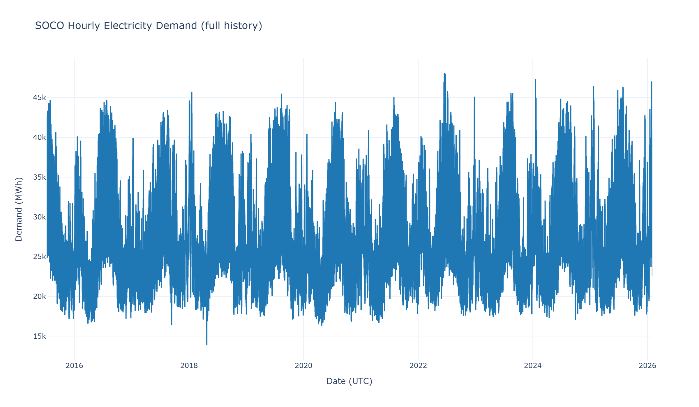
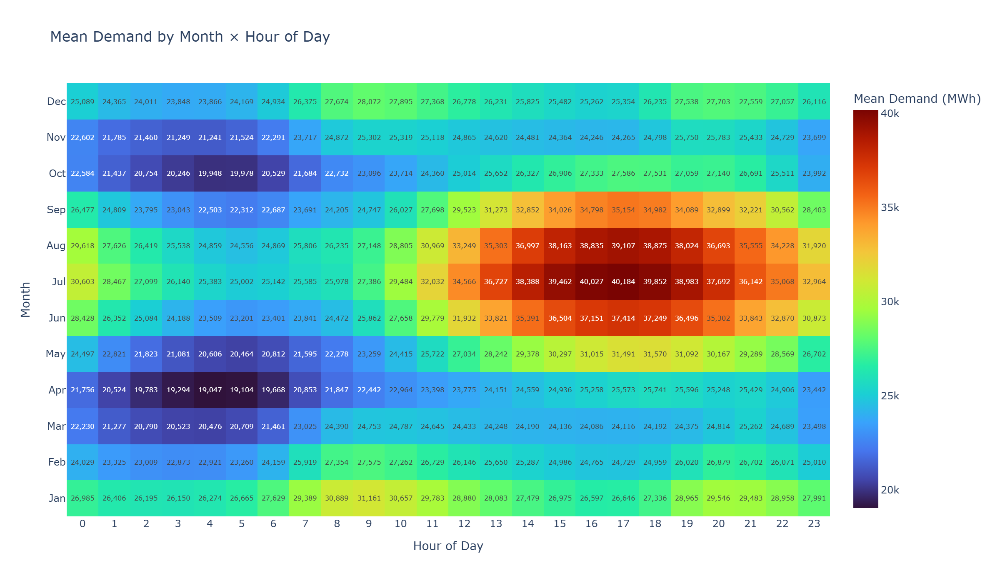

# SOCO Energy Demand Forecasting

**Short-term electricity demand forecasting project for the Southern Company (SOCO) balancing authority.** This project builds a clean, portfolio-ready workflow for forecasting the full hourly demand trajectory over the next 48 hours using historical electricity demand, calendar features, lagged demand behavior, rolling-window statistics, and regional weather data.

The repository is currently focused on data preparation, exploratory analysis, and feature engineering. Model training and experiment tracking are planned as the next stage.

---

## Project Highlights

* **Task:** Short-term hourly electricity demand forecasting
* **Forecast horizon:** Next 48 hourly demand values
* **Target:** `demand_imputed_pudl_mwh`
* **Balancing authority:** Southern Company (SOCO)
* **Data:** Hourly demand from PUDL/EIA-930 plus regional hourly weather observations
* **Methods:** Time-series feature engineering, statistical forecasting, additive forecasting, gradient boosting
* **Tracking plan:** MLflow experiment tracking for all model families

This project is designed to demonstrate a practical forecasting workflow that connects utility-domain data preparation with reproducible machine learning experimentation.

---

## Motivation and Problem Statement

Electricity demand changes hour by hour with temperature, daily routines, weekly cycles, seasonal effects, holidays, and recent demand behavior. Short-term demand forecasts help utilities and grid operators plan generation, monitor load patterns, and prepare for near-term operating conditions.

**Goal:**
Build a forecasting workflow that predicts the next 48 hourly SOCO demand values from historical demand and weather information.

The final modeling dataset uses the cleaned and imputed demand field:

```text
demand_imputed_pudl_mwh
```

The project should be read as a short-term load forecasting project, not as a single-point 48-hour-ahead prediction task. The objective is to forecast the complete hourly path across the next two days.

---

## Dataset Description

The project combines hourly electricity demand with regional weather features for locations representative of the SOCO service territory.

### Electricity Demand Data

Electricity demand data comes from the PUDL/EIA-930 hourly operations workflow prepared in:

```text
e01_pudl_data_hourly_soco.ipynb
```

The demand target is the cleaned/imputed SOCO demand series:

```text
demand_imputed_pudl_mwh
```

### Weather Data

Regional hourly weather data is prepared in:

```text
e02_soco_region_hourly_weather_data.ipynb
```

Weather features include city-level and regional summaries for:

* Temperature
* Relative humidity
* Dew point
* Precipitation
* Surface pressure
* Wind speed
* Shortwave radiation

### Final Modeling Dataset

The final modeling dataset is generated by:

```text
e03_merge_energy_and_weather.ipynb
```

Local dataset:

```text
data/soco_modeling_dataset.csv
```

The modeling dataset is tracked with Git LFS because it is larger than standard GitHub-friendly source files. It can also be reproduced by running the data preparation notebooks in order. The data dictionary is tracked in this repository:

```text
data/soco_modeling_data_dictionary.csv
data/soco_modeling_data_dictionary.md
```

---

## Feature Engineering Strategy

The modeling dataset includes features commonly used in short-term load forecasting.

### Demand History

* Hourly lag features, including 1-hour, 2-hour, 3-hour, 24-hour, 48-hour, 72-hour, and 168-hour lags
* Rolling-window demand statistics over recent hourly windows
* Daily and weekly demand pattern information

### Calendar and Time Features

* Hour, day of week, day of month, day of year, month, quarter, and year
* Weekend, month boundary, quarter boundary, and holiday flags
* Cyclical encodings for daily, weekly, monthly, and annual seasonality

### Weather Features

* City-level weather measurements across selected SOCO-region cities
* Regional mean weather features
* Temperature, humidity, dew point, wind, precipitation, pressure, and solar radiation signals

---

## Exploratory Analysis

Exploratory analysis is complete in:

```text
e04_EDA.ipynb
```

The EDA workflow reviews target behavior, demand seasonality, missingness, weather relationships, lag structure, and correlations between engineered features and demand.

Example outputs:





---

## Modeling Workflow

Model training is organized around one shared modeling dataset and one shared time-aware split. This keeps the comparison fair: SARIMAX, Prophet, and XGBoost all see the same training, validation, and test periods.

The split is defined in:

```text
configs/modeling_config.json
```

The split manifest is generated by:

```bash
conda run -n energy_demand_ml_env001 python scripts/01_prepare_time_splits.py
```

### Time-Aware Split

This is a time-series forecasting project, so the workflow does **not** use random train/test splitting. Random splits would allow later grid conditions, weather regimes, seasonal demand patterns, and lagged demand behavior to influence earlier model training.

The project uses a sequential UTC split:

| Split | Start | End | Rows | Purpose |
|---|---:|---:|---:|---|
| Train | 2015-07-08 06:00 UTC | 2023-12-31 23:00 UTC | 74,370 | Fit model parameters |
| Validation | 2024-01-01 00:00 UTC | 2024-12-31 23:00 UTC | 8,784 | Tune Prophet and XGBoost; compare candidate settings |
| Test | 2025-01-01 00:00 UTC | 2026-02-01 06:00 UTC | 9,511 | Final holdout evaluation only |

The exact split dates and index ranges are saved in:

```text
reports/splits/time_split_manifest.json
reports/splits/time_split_summary.csv
```

### Leakage Controls

The workflow is designed so future observations do not influence earlier training or validation steps:

* Training data always comes before validation data.
* Validation data always comes before test data.
* The test set is reserved for final evaluation after model selection.
* Prophet and XGBoost hyperparameters are selected using validation metrics only.
* XGBoost uses engineered lag and rolling-window features that represent past demand behavior.
* During XGBoost validation and test scoring, demand lag and rolling features are recomputed recursively instead of using precomputed validation/test target-derived columns.
* Feature columns are checked for future-looking names such as `lead`, `future`, `next_`, or `ahead`.
* SARIMAX and Prophet use the same target series and the same timestamp windows used by XGBoost.

For operational 48-hour forecasting, future weather values should come from weather forecasts rather than realized future observations. In this portfolio workflow, historical weather rows in `data/soco_modeling_dataset.csv` are used as the stand-in forecast weather during backtesting and model comparison.

### MLflow Tracking

MLflow experiment tracking is configured with the experiment name:

```text
soco-energy-demand-forecasting
```

Each model run logs:

* Model name
* Train, validation, and test split dates
* Hyperparameters and tuning settings
* Validation and test metrics
* Prediction tables
* Plotly figures and diagnostic artifacts
* Trained model artifacts where appropriate

Local MLflow tracking uses `mlflow.db`, which is intentionally excluded from Git. Run artifacts are written locally by MLflow and are not committed to the repository.

To inspect local runs:

```bash
conda run -n energy_demand_ml_env001 mlflow ui --backend-store-uri sqlite:///mlflow.db
```

### Evaluation Metrics and Visualizations

All models are evaluated with the same core metrics:

* MAE
* RMSE
* MAPE

Plotly is used for modeling, tuning, evaluation, and reporting figures. Important plots are exported to `reports/figures/` and logged to MLflow where useful, including actual vs. predicted demand, residual plots, model comparison charts, and XGBoost feature importance.

The three model families below are intentionally selected to compare a demand-only statistical baseline, a demand-only decomposable time-series model, and a feature-rich machine learning model.

### 1. SARIMAX Baseline

**Status:** Planned / in progress

* Model: `SARIMAX(1,1,1)(1,1,1,24)`
* Inputs: Demand only
* Purpose: Statistical baseline for hourly load forecasting
* Tuning: Use already-selected hyperparameters
* Tracking: Train and evaluate with MLflow using `scripts/02_train_sarimax.py`

### 2. Prophet

**Status:** Planned / in progress

* Model: Prophet
* Inputs: Demand only
* Seasonality: Daily and weekly seasonality
* Exogenous variables: Not used
* Tuning: Optuna hyperparameter tuning
* Tracking: MLflow experiment tracking for tuning and final evaluation using `scripts/03_tune_prophet.py`

### 3. XGBoost

**Status:** Planned / in progress

* Model: XGBoost regression workflow
* Inputs: Engineered lag, rolling-window, calendar, and weather features
* Forecast strategy: Recursive 48-hour forecasting windows
* Recursive feature handling: Within each 48-hour window, demand lag and rolling features use prior actual demand before the forecast origin and prior predicted demand inside the window
* Weather assumption: Historical weather columns in the modeling dataset serve as forecast weather during backtesting
* Tuning: Optuna hyperparameter tuning
* Tracking: MLflow experiment tracking for tuning and final evaluation using `scripts/04_tune_xgboost.py`

---

## Current Project Status

Completed:

* SOCO hourly demand extraction and cleaning workflow
* Regional hourly weather data preparation
* Energy and weather data merge
* Final modeling dataset creation
* Feature engineering for lags, rolling windows, calendar variables, cyclical encodings, and weather summaries
* Exploratory analysis and exported figures
* Data dictionary for the modeling dataset
* Shared time-aware train/validation/test split configuration
* Reusable modeling scripts for SARIMAX, Prophet, XGBoost, and model comparison

In progress / planned:

* SARIMAX baseline training and evaluation
* Prophet tuning, training, and evaluation
* XGBoost tuning, training, and evaluation
* Forecast comparison over the 48-hour horizon
* Portfolio summary of model results and final recommendations

---

## Repository Structure

```text
.
├── app/
│   └── Streamlit application files planned for a later portfolio demo
├── data/
│   ├── soco_hourly_operations.csv
│   ├── soco_region_hourly_weather.csv
│   ├── soco_modeling_dataset.csv
│   ├── soco_modeling_data_dictionary.csv
│   └── soco_modeling_data_dictionary.md
├── figures/
│   └── EDA figures exported from the analysis notebooks
├── configs/
│   └── Shared modeling configuration and split dates
├── scripts/
│   └── Reproducible split, training, tuning, and comparison entry points
├── src/
│   └── Reusable project utilities for data splitting, metrics, Plotly figures, and MLflow
├── reports/
│   ├── figures/
│   ├── metrics/
│   └── splits/
├── notes/
│   └── Local planning notes and references, excluded from GitHub
├── e01_pudl_data_hourly_soco.ipynb
├── e02_soco_region_hourly_weather_data.ipynb
├── e03_merge_energy_and_weather.ipynb
├── e04_EDA.ipynb
├── energy_demand_ml_env001.yml
├── requirements.txt
├── Dockerfile
├── .dockerignore
├── .gitignore
└── README.md
```

CSV data files are tracked with Git LFS:

```text
data/soco_hourly_operations.csv
data/soco_region_hourly_weather.csv
data/soco_modeling_dataset.csv
```

Parquet and ZIP files are kept local and are not uploaded to GitHub.

---

## Reproducibility

### Option 1: Conda Environment

Create the full project environment:

```bash
conda env create -f energy_demand_ml_env001.yml
conda activate energy_demand_ml_env001
python -m ipykernel install --user --name energy_demand_ml_env001 --display-name "Python (energy_demand_ml_env001)"
```

### Option 2: Pip Environment

The `requirements.txt` file provides a lighter runtime-oriented environment intended to support future Dockerization and app deployment work:

```bash
python -m venv .venv
.venv\Scripts\activate
pip install -r requirements.txt
```

For full training and experimentation, the conda environment is recommended.

### Modeling Scripts

Run modeling scripts from the repository root with the conda environment:

```bash
conda run -n energy_demand_ml_env001 python scripts/01_prepare_time_splits.py
conda run -n energy_demand_ml_env001 python scripts/02_train_sarimax.py
conda run -n energy_demand_ml_env001 python scripts/03_tune_prophet.py
conda run -n energy_demand_ml_env001 python scripts/04_tune_xgboost.py
conda run -n energy_demand_ml_env001 python scripts/05_compare_models.py
```

The SARIMAX, Prophet, and XGBoost scripts all load the same `configs/modeling_config.json` file and therefore use the same split windows.

---

## Notebook Run Order

Run the notebooks in this order:

```text
1. e01_pudl_data_hourly_soco.ipynb
2. e02_soco_region_hourly_weather_data.ipynb
3. e03_merge_energy_and_weather.ipynb
4. e04_EDA.ipynb
```

Expected local outputs include:

```text
data/soco_modeling_dataset.csv
data/soco_modeling_data_dictionary.csv
data/soco_modeling_data_dictionary.md
figures/*.png
```

The modeling workflow is implemented as scripts so it can be rerun consistently and extended with additional models later.

---

## Planned Next Steps

* Run SARIMAX training with MLflow tracking
* Run Prophet tuning and evaluation with Optuna and MLflow
* Run XGBoost tuning and evaluation with Optuna and MLflow
* Evaluate models across the 48-hour forecast horizon
* Compare model performance using MAE, RMSE, MAPE, and horizon-specific error plots
* Add final model results, forecast visualizations, and a concise portfolio interpretation
* Expand the Streamlit app once final model outputs are available

---

## GitHub Repository Metadata

Suggested repository name:

```text
soco-energy-demand-forecasting
```

Suggested repository description:

```text
Short-term hourly electricity demand forecasting for the SOCO balancing authority using historical load, weather data, SARIMAX, Prophet, and XGBoost.
```

Suggested topics:

```text
energy-demand-forecasting
time-series-forecasting
machine-learning
xgboost
prophet
sarimax
weather-data
energy-analytics
python
mlflow
optuna
electricity-demand
load-forecasting
```

---

## Disclaimer

This project is for research, learning, and portfolio demonstration purposes only. Forecasts and analysis are illustrative and should not be used for operational utility planning without additional validation.

---

## Author

**Husayn El Sharif**  
Senior Data Scientist / Machine Learning Engineer
